# Threat-Hunting-Reconnaissance-Suspicious-HTTP-Activity-Analysis

In this project, i performed threat hunting using splunk to analyze HTTP traffic within the botsv2 dataset. The objective was identify to suspicious behaviour, investigate anomalies, and determine whether malicious activity occurred.

---
# Scenerio

Law enforcement warned our organization about a current campaign that may have impacted our organization. This campaign has been active against other organizations from the same industry sector. Based on the information below we must develop a Hunt hypothesis, plan of action, and execute the plan.

---

## **Tools Used**
- Splunk
- OSINT (Google, AbuseIPDB, IPinfo)
- HTTP Log Analysis

  ---

  ## **What I Did**

1 . Identified Available Data
     
- I started by checking available log in splunk using METADATA

```splunk
| metadata type=sourcetypes index=botsv2
```
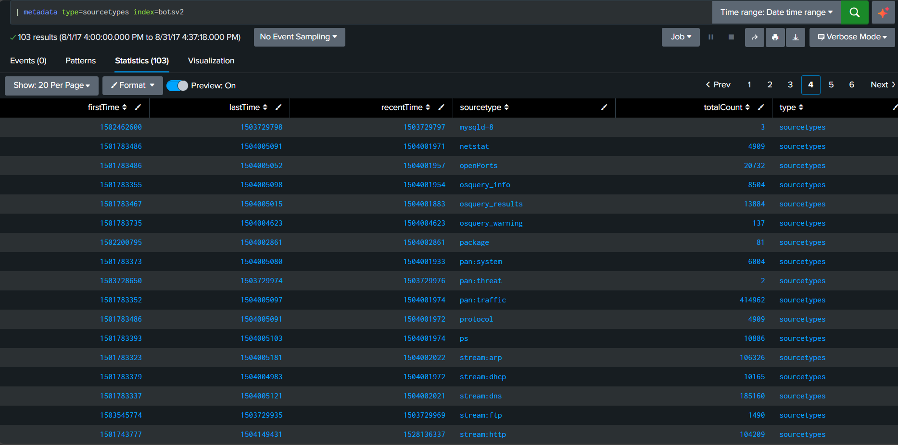

2 . Focused on HTTP traffic

- To analyze web traffic

```splunk
index=botsv2 sourcetype=stream:http
```
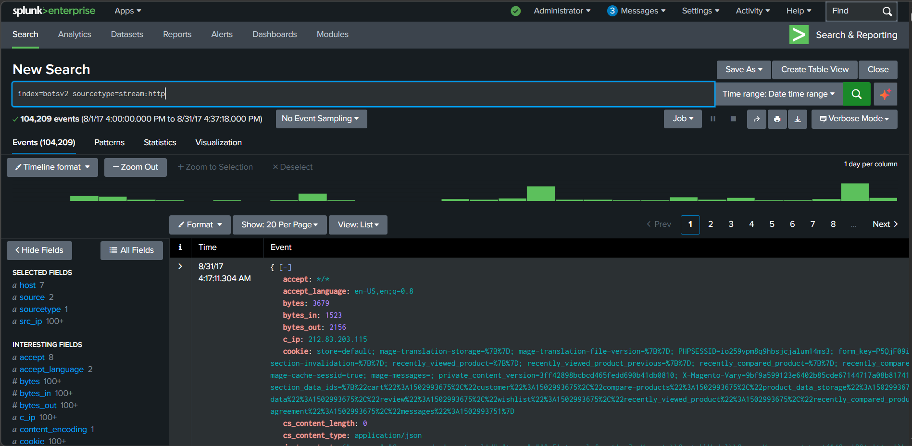

3 . Targeted a Specific Website

- Narrowed it down to a specific website

```splunk
index=botsv2 sourcetype=stream:http site="www.froth.ly"
```
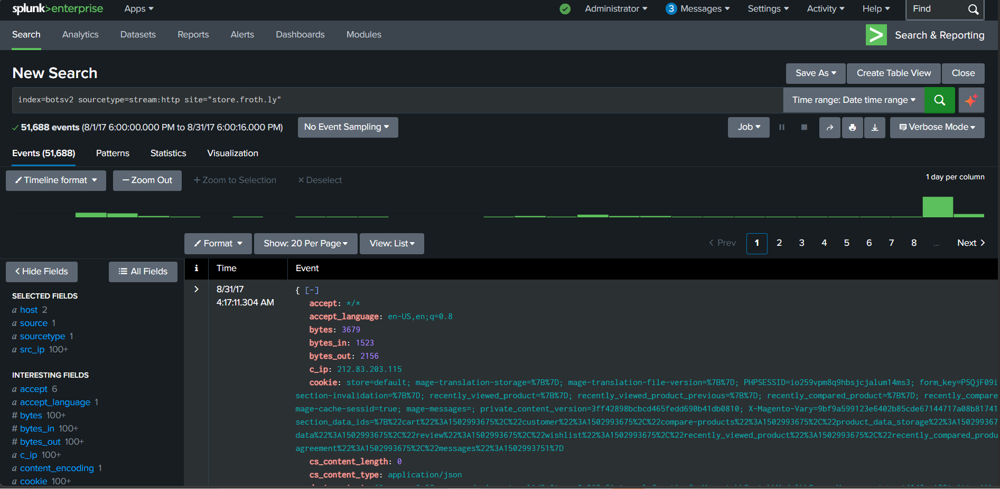

4 . Analyze User Agent

- To identify unusual clients

```splunk
index=botsv2 sourcetype=stream:http site="www.froth.ly"
| stats count by http_user_agent
| sort +count
```
- I noticed a strange user agent named "Naenara Browser" which look unusual.

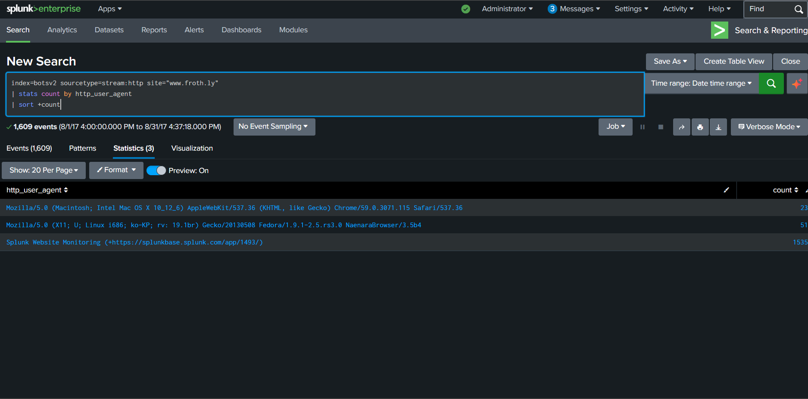

---

5 . Investigated the User Agent

* Using OSINT research:
- l investigated it and found out its a rare browser associated with North Korea
- Observed its been run on a Linux machine

*  This is unusual and flagged for deeper investigation.

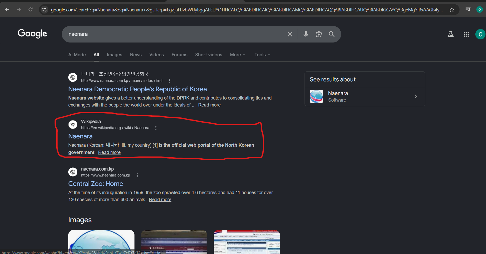
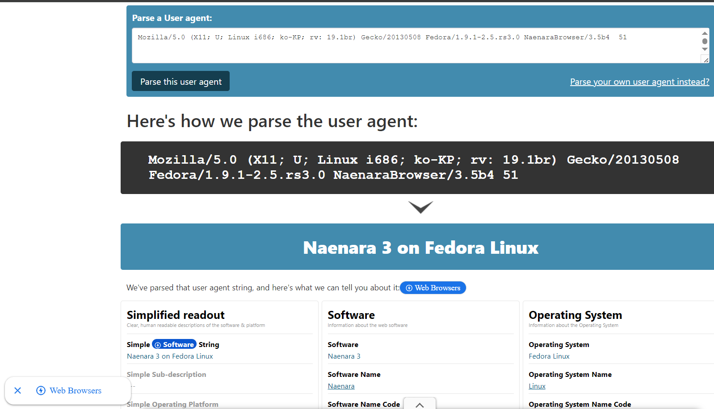
  
---

6 . Pivoted to Source IP
- l identified the IP generating the suspicious traffic:

```splunk
| stats count src_ip
```
- Found IP: 85.203.47.86 makes 51 requests to the website which looks suspicious and requires another investigation

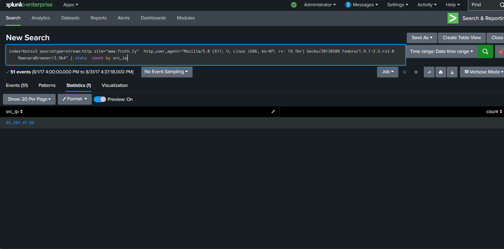

---

7. Performed Threat Intelligence Checks

Using:

- VirusTotal
- IPinfo
- AbuseIPDB

Finding: 

- Flagged in VirusTotal as suspicious
- IP linked to Express VPN service and from Denmark
- Found in the database and had been reported 63 times
  
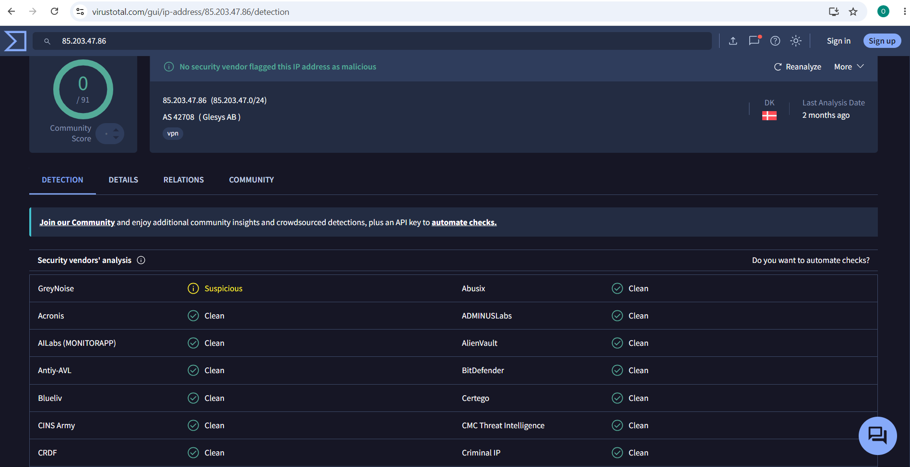
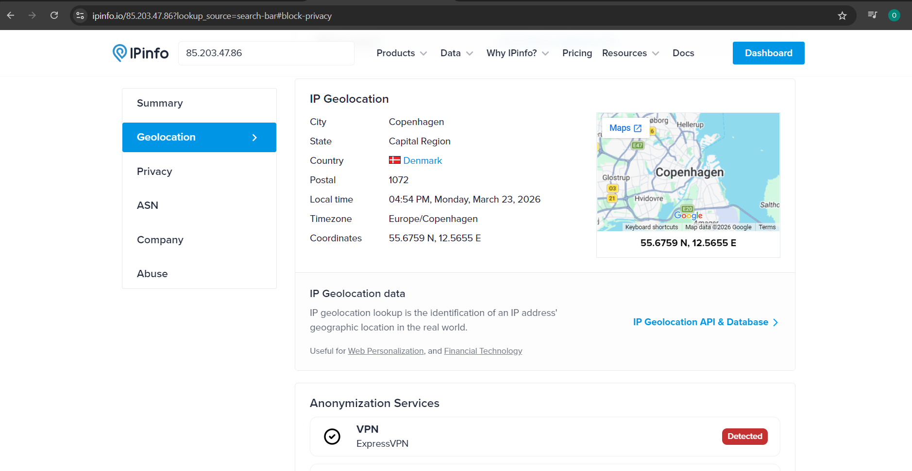
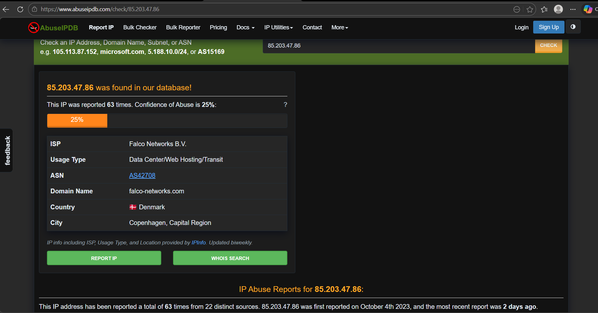

---

8 . Investigate User Activity

Discoverd that the user: 
- Accessed the targeted website
- Downloaded a file: company_contacts.xlsx

- Possible data exfiltration or reconnaissance activity

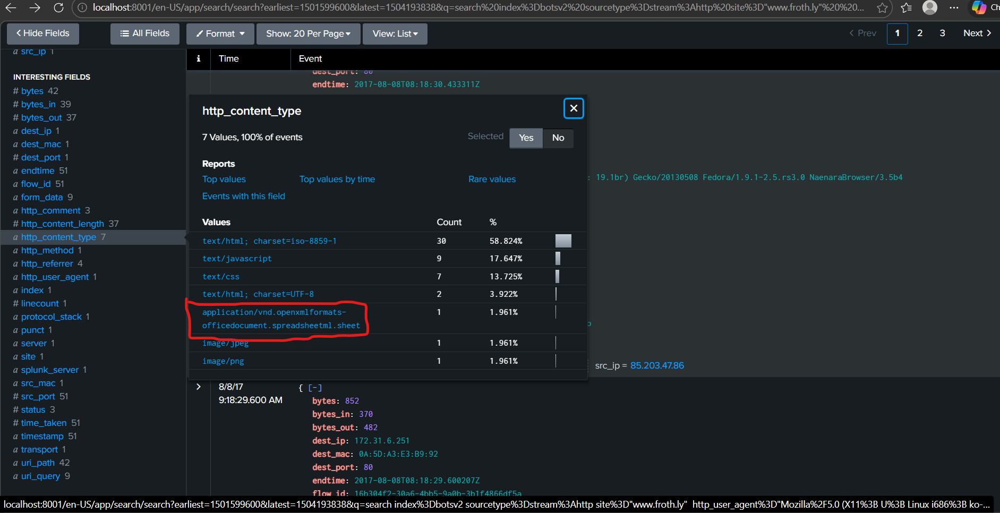
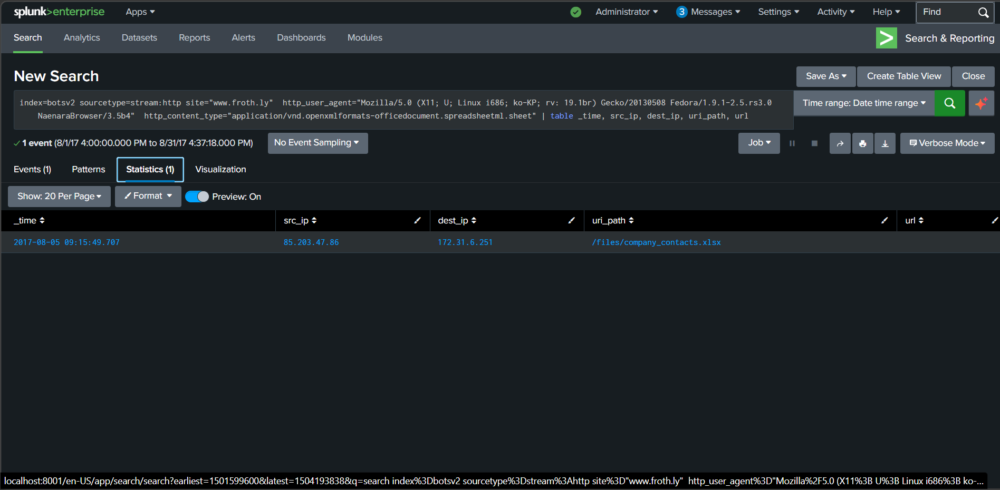

## **Outcome**

- ldentified suspicious HTTP traffic
- Detected unusual user agent (Naenara Browser)
- Traced activity to a VPN-associated IP
- Confirmed repeated access behaviour (51 requests)
- identified potential sensitive file download

## **Key Learnings**

- Always investigate unsual user agents
- High request counts can indicate automated or malicious behaviour
- VPN usage can help attackers hide identity
- OSINT tolls are critical in threat hunting
- Building a timeline helps understand attacker behaviour


